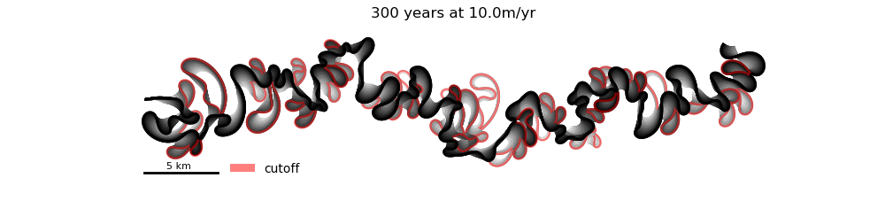

# Cutoffs

A library for simulating channel centerline migration that accounts for nonlocal effects from cutoffs, and analyzing resulting cutoff distributions.

## HKplus
This module builds upon previous implementations of Howard and Knutson's centerline migration model based on local and weigthed upstream curvatures[1,2]. With its main structure modeled after MeanderPy, this version considers additions to migration rate from cutoff events' estimated hydraulic effects when calculating centerline migration.   After a cutoff occurs, a gaussian bump is introduced to migration rate in the location on the centerline where that cutoff occured, before upstream curvature is accounted for by HK's model. The dimensions and decay of each bump are set accordance with ours and others' findings from remote sensing analyses[3], but can easily be adjusted.

## SpaceTime
 A set of functions used to test cutoff distributions collected by HKplus iterations for spatiotemporal clustering.  This includes a monte carlo sampling method to test cutoff distibutions against randomly-generated and therefore homogenous and independent point processes[4].   

## Demonstration
A full notebook will be available shortly, but here is are some example outputs:

*simulate channel centerline migration*

*record when and where meander bend cutoffs occur as events in 2-d space-time* 

*statistically compare intensities of cutoff events to randomness*

## Dependencies
Numpy, Scipy, Pandas,Matplotlib, Seaborn

## References
[1]https://github.com/zsylvester/meanderpy  
[2]Zoltán Sylvester; Paul Durkin; Jacob A. Covault; High curvatures drive river meandering. Geology (2019) 47 (3): 263–266.
DOI: 10.1130/G45608.1  
[3]Jon Schwenk, Efi Foufoula‐Georgiou; Meander cutoffs nonlocally accelerate upstream and downstream migration and channel widening. Geophysical Research Letters (2016) 43 (24): 12,437-12,445. DOI: 10.1002/2016GL071670  
[4]Peter Diggle, Statistical Analysis of Spatial and Spatio-Temporal Point Patterns, Third Edition. 2014. 

